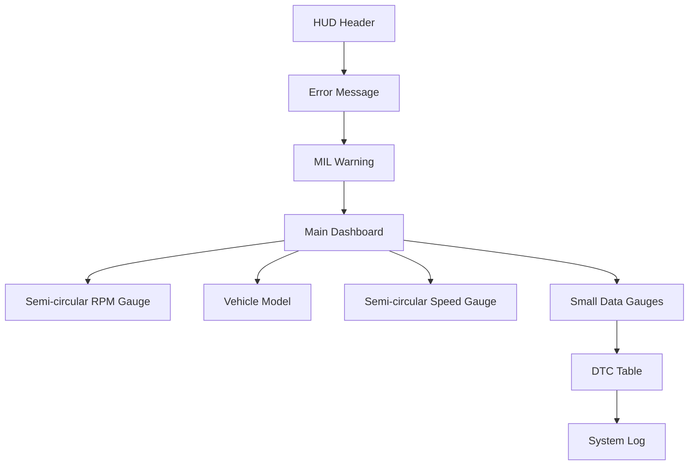

# Tesla-Inspired Car HUD Redesign Plan

## 1. Layout Structure Changes (App.vue)

The new layout will center the vehicle model and flank it with semi-circular gauges, creating a cleaner, Tesla-like appearance:



### App.vue Grid Layout Changes:

```css
.main-content {
  display: grid;
  grid-template-columns: 1fr 1.2fr 1fr;
  grid-template-rows: auto auto;
  grid-template-areas: 
    "rpm-gauge vehicle speed-gauge"
    "small-gauges small-gauges small-gauges";
  gap: var(--spacing-md);
  width: 100%;
}

.rpm-gauge-container {
  grid-area: rpm-gauge;
  display: flex;
  justify-content: center;
  align-items: center;
}

.vehicle-container {
  grid-area: vehicle;
  display: flex;
  justify-content: center;
  align-items: center;
}

.speed-gauge-container {
  grid-area: speed-gauge;
  display: flex;
  justify-content: center;
  align-items: center;
}

.small-gauges-container {
  grid-area: small-gauges;
  display: grid;
  grid-template-columns: repeat(4, 1fr);
  gap: var(--spacing-md);
}
```

## 2. New SemiCircleGauge Component

A new component will be created to display semi-circular gauges for RPM and speed:

```vue
// SemiCircleGauge.vue
<template>
  <div class="semi-circle-gauge glass-panel">
    <div class="gauge-label">{{ label }}</div>
    <div class="gauge-value">{{ displayValue }}</div>
    <div class="gauge-unit">{{ unit }}</div>
    <div class="gauge-container">
      <svg class="gauge-svg" viewBox="0 0 200 120">
        <!-- Background track -->
        <path
          class="gauge-track"
          d="M10,110 A100,100 0 0,1 190,110"
          stroke="rgba(255,255,255,0.1)"
          stroke-width="10"
          fill="none"
        />
        
        <!-- Colored arc that shows the current value -->
        <path
          class="gauge-progress"
          :class="progressClass"
          :d="arcPath"
          stroke="url(#gaugeGradient)"
          stroke-width="10"
          stroke-linecap="round"
          fill="none"
        />
        
        <!-- Gauge ticks -->
        <g class="gauge-ticks">
          <line
            v-for="tick in renderedTicks"
            :key="tick.angle"
            :x1="tick.x1"
            :y1="tick.y1"
            :x2="tick.x2"
            :y2="tick.y2"
            class="tick"
            :class="{'major-tick': tick.major}"
          />
        </g>
        
        <!-- Tick labels -->
        <g class="gauge-labels">
          <text
            v-for="label in tickLabels"
            :key="label.value"
            :x="label.x"
            :y="label.y"
            class="tick-label"
          >{{ label.text }}</text>
        </g>
        
        <!-- Needle -->
        <g class="gauge-needle" :style="{ transform: `rotate(${needleRotation}deg)`, 'transform-origin': '100px 110px' }">
          <line x1="100" y1="110" x2="100" y2="30" stroke="var(--text-primary)" stroke-width="2" />
          <circle cx="100" cy="110" r="5" fill="var(--text-primary)" />
        </g>
        
        <!-- Gradient definition -->
        <defs>
          <linearGradient :id="gradientId" x1="0%" y1="0%" x2="100%" y2="0%">
            <stop :stop-color="startColor" offset="0%" />
            <stop :stop-color="endColor" offset="100%" />
          </linearGradient>
        </defs>
      </svg>
    </div>
  </div>
</template>

<script setup>
import { computed } from 'vue';

const props = defineProps({
  label: String,
  value: Number,
  maxValue: Number,
  unit: String,
  startColor: {
    type: String,
    default: 'rgba(255,255,255,0.7)'
  },
  endColor: {
    type: String,
    default: 'rgba(255,255,255,0.7)'
  },
  progressClass: String,
  majorTicks: {
    type: Number,
    default: 5
  },
  minorTicks: {
    type: Number,
    default: 20
  }
});

// Generate a unique ID for the gradient
const gradientId = computed(() => `gauge-gradient-${props.label.toLowerCase().replace(/\s+/g, '-')}`);

// Display value with proper formatting
const displayValue = computed(() => {
  if (props.value === null) return '---';
  return props.value.toLocaleString();
});

// Calculate the percentage of the current value relative to max
const percentage = computed(() => {
  if (props.value === null) return 0;
  return Math.min(100, Math.max(0, (props.value / props.maxValue) * 100));
});

// Calculate the sweep angle based on percentage (0 to 180 degrees)
const sweepAngle = computed(() => {
  return (percentage.value / 100) * 180;
});

// Calculate the needle rotation angle
const needleRotation = computed(() => {
  return (percentage.value / 100) * 180 - 90;
});

// Generate the SVG path for the arc
const arcPath = computed(() => {
  // If value is 0, return empty path
  if (percentage.value === 0) return '';
  
  const startAngle = -180;
  const endAngle = startAngle + sweepAngle.value;
  
  // Convert angles to radians
  const startRad = (startAngle * Math.PI) / 180;
  const endRad = (endAngle * Math.PI) / 180;
  
  // Calculate start and end points
  const radius = 100;
  const cx = 100;
  const cy = 110;
  
  const x1 = cx + radius * Math.cos(startRad);
  const y1 = cy + radius * Math.sin(startRad);
  const x2 = cx + radius * Math.cos(endRad);
  const y2 = cy + radius * Math.sin(endRad);
  
  // Use a large arc if angle > 180 degrees
  const largeArcFlag = sweepAngle.value > 180 ? 1 : 0;
  
  return `M${x1},${y1} A${radius},${radius} 0 ${largeArcFlag},1 ${x2},${y2}`;
});

// Generate tick marks
const renderedTicks = computed(() => {
  const ticks = [];
  const totalTicks = props.minorTicks;
  const radius = 100;
  const cx = 100;
  const cy = 110;
  const outerRadius = radius + 5;
  const majorTickLength = 15;
  const minorTickLength = 7;
  
  for (let i = 0; i <= totalTicks; i++) {
    const angle = -180 + (i / totalTicks) * 180;
    const rad = (angle * Math.PI) / 180;
    const isMajorTick = i % (totalTicks / props.majorTicks) === 0;
    
    const tickLength = isMajorTick ? majorTickLength : minorTickLength;
    
    const x1 = cx + radius * Math.cos(rad);
    const y1 = cy + radius * Math.sin(rad);
    const x2 = cx + (radius - tickLength) * Math.cos(rad);
    const y2 = cy + (radius - tickLength) * Math.sin(rad);
    
    ticks.push({
      x1, y1, x2, y2,
      major: isMajorTick,
      angle
    });
  }
  
  return ticks;
});

// Generate tick labels
const tickLabels = computed(() => {
  const labels = [];
  const totalLabels = props.majorTicks + 1;
  const radius = 75;
  const cx = 100;
  const cy = 110;
  
  for (let i = 0; i < totalLabels; i++) {
    const value = (i / (totalLabels - 1)) * props.maxValue;
    const angle = -180 + (i / (totalLabels - 1)) * 180;
    const rad = (angle * Math.PI) / 180;
    
    const x = cx + (radius - 20) * Math.cos(rad);
    const y = cy + (radius - 20) * Math.sin(rad);
    
    labels.push({
      value,
      text: Math.round(value).toLocaleString(),
      x,
      y
    });
  }
  
  return labels;
});
</script>

<style scoped>
.semi-circle-gauge {
  background: rgba(25, 32, 45, 0.4);
  border-radius: var(--border-radius-lg);
  border: 1px solid rgba(255, 255, 255, 0.07);
  padding: var(--spacing-md);
  display: flex;
  flex-direction: column;
  align-items: center;
  height: 100%;
}

.gauge-label {
  font-size: 1.2rem;
  font-weight: 600;
  color: var(--text-secondary);
  text-transform: uppercase;
  letter-spacing: 1.5px;
  margin-bottom: var(--spacing-sm);
}

.gauge-value {
  font-size: 3rem;
  font-weight: 700;
  color: var(--text-primary);
  line-height: 1;
}

.gauge-unit {
  font-size: 1.2rem;
  color: var(--text-secondary);
  margin-top: var(--spacing-sm);
  margin-bottom: var(--spacing-sm);
}

.gauge-container {
  width: 100%;
  position: relative;
}

.gauge-svg {
  width: 100%;
  height: auto;
}

.gauge-track {
  transition: all 0.3s ease;
}

.gauge-progress {
  transition: all 0.8s cubic-bezier(0.16, 1, 0.3, 1);
}

.tick {
  stroke: rgba(255, 255, 255, 0.3);
  stroke-width: 1;
}

.major-tick {
  stroke: rgba(255, 255, 255, 0.6);
  stroke-width: 2;
}

.tick-label {
  fill: var(--text-secondary);
  font-size: 0.7rem;
  text-anchor: middle;
  alignment-baseline: middle;
}

.gauge-needle {
  transition: transform 0.8s cubic-bezier(0.16, 1, 0.3, 1);
}
</style>
```

## 3. Small Gauge Component

For smaller data points, a simplified gauge component will be created to display values in a Tesla-like minimal format:

```vue
// SmallGauge.vue
<template>
  <div class="small-gauge glass-panel">
    <div class="gauge-label">{{ label }}</div>
    <div class="gauge-value-container">
      <div class="gauge-value">{{ displayValue }}</div>
      <div class="gauge-unit">{{ unit }}</div>
    </div>
    <div class="gauge-bar-container">
      <div class="gauge-bar-background"></div>
      <div
        class="gauge-bar-fill"
        :class="barClass"
        :style="{ width: `${percentage}%` }"
      ></div>
    </div>
  </div>
</template>

<script setup>
import { computed } from 'vue';

const props = defineProps({
  label: String,
  value: Number,
  maxValue: Number,
  unit: String,
  barClass: String
});

const displayValue = computed(() => {
  if (props.value === null) return '---';
  return props.value.toLocaleString();
});

const percentage = computed(() => {
  if (props.value === null) return 0;
  return Math.min(100, Math.max(0, (props.value / props.maxValue) * 100));
});
</script>

<style scoped>
.small-gauge {
  background: rgba(25, 32, 45, 0.4);
  border-radius: var(--border-radius-md);
  border: 1px solid rgba(255, 255, 255, 0.07);
  padding: var(--spacing-md);
  display: flex;
  flex-direction: column;
  height: 100%;
}

.gauge-label {
  font-size: 0.9rem;
  font-weight: 600;
  color: var(--text-secondary);
  text-transform: uppercase;
  letter-spacing: 1px;
  margin-bottom: var(--spacing-sm);
}

.gauge-value-container {
  display: flex;
  align-items: baseline;
  margin-bottom: var(--spacing-sm);
}

.gauge-value {
  font-size: 2rem;
  font-weight: 700;
  color: var(--text-primary);
  line-height: 1;
  margin-right: var(--spacing-sm);
}

.gauge-unit {
  font-size: 0.9rem;
  color: var(--text-secondary);
}

.gauge-bar-container {
  position: relative;
  height: 4px;
  width: 100%;
  background: rgba(255, 255, 255, 0.1);
  border-radius: 2px;
  overflow: hidden;
}

.gauge-bar-fill {
  position: absolute;
  top: 0;
  left: 0;
  height: 100%;
  background: rgba(255, 255, 255, 0.7);
  border-radius: 2px;
  transition: width 0.8s cubic-bezier(0.16, 1, 0.3, 1);
}
</style>
```

## 4. Tesla-Inspired Styling Guidelines

### Color Palette

To achieve the minimalist Tesla look while retaining subtle accent colors:

```css
:root {
  /* Base Colors */
  --bg-dark: #121212;
  --glass-bg: rgba(20, 20, 20, 0.7);
  --glass-border: rgba(255, 255, 255, 0.05);
  --text-primary: #FFFFFF;
  --text-secondary: rgba(255, 255, 255, 0.6);
  
  /* Accent Colors (more subtle) */
  --accent-primary: rgba(255, 255, 255, 0.85);
  --accent-secondary: rgba(255, 255, 255, 0.7);
  --accent-warning: rgba(245, 166, 35, 0.85);
  --accent-danger: rgba(252, 84, 71, 0.85);
  
  /* Gauge Colors (more monochromatic) */
  --rpm-gradient-start: rgba(255, 255, 255, 0.7);
  --rpm-gradient-end: rgba(255, 255, 255, 0.9);
  --speed-gradient-start: rgba(255, 255, 255, 0.7);
  --speed-gradient-end: rgba(255, 255, 255, 0.9);
  
  /* Status Colors (kept for status indicators) */
  --status-connected: rgba(57, 213, 152, 0.85);
  --status-connecting: rgba(245, 166, 35, 0.85);
  --status-error: rgba(252, 84, 71, 0.85);
  --status-disconnected: rgba(150, 150, 150, 0.6);
}
```

### Typography

```css
body {
  font-family: 'Titillium Web', sans-serif; /* Current font is already clean */
  font-weight: 300; /* Use lighter font weight as base */
}

h1, h2, h3, .gauge-value {
  font-weight: 700; /* Keep headings and values bold */
}

.gauge-label {
  font-weight: 400; /* Lighter weight for labels */
  letter-spacing: 1px; /* Slight letter spacing for better readability */
}
```

### Component Styling

```css
/* Cleaner glass panels with less blur */
.glass-panel {
  background: var(--glass-bg);
  border-radius: var(--border-radius-lg);
  border: 1px solid var(--glass-border);
  backdrop-filter: blur(5px); /* Reduced blur */
  box-shadow: 0 4px 20px rgba(0, 0, 0, 0.2); /* Subtle shadow */
}

/* Less elevation on hover for a more minimal effect */
.glass-panel:hover {
  transform: translateY(-1px); /* More subtle movement */
  box-shadow: 0 5px 25px rgba(0, 0, 0, 0.25);
}
```

## 5. Changes to Existing Components

### VehicleModelPlaceholder.vue

Update to be more prominent and Tesla-like:

```css
.vehicle-model-placeholder {
  min-height: 250px; /* Taller to match side gauges */
  background: rgba(20, 20, 20, 0.5); /* Slightly more visible than other panels */
  border: 1px solid rgba(255, 255, 255, 0.07);
}

.car-silhouette {
  width: 70%; /* Larger vehicle representation */
  height: 60%;
  opacity: 0.7; /* More visible */
}
```

### Other Components

- **HudHeader.vue**: Simplify with cleaner typography and more minimal appearance
- **ErrorMessage.vue** and **MilWarning.vue**: Update with more subtle styling but keep accent colors for important alerts
- **DtcTable.vue** and **SystemLog.vue**: Maintain functionality but update styling to match the Tesla aesthetic

## 6. List of Components to Create or Modify

### New Components:
1. **SemiCircleGauge.vue**: For RPM and Speed gauges
2. **SmallGauge.vue**: For smaller data points

### Modified Components:
1. **App.vue**: New layout with central vehicle model and flanking gauges
2. **VehicleModelPlaceholder.vue**: More prominent styling
3. **main.css**: Updated color variables for Tesla aesthetic
4. **HudHeader.vue**: More minimal styling
5. **ErrorMessage.vue**: Updated styling
6. **MilWarning.vue**: Updated styling
7. **DtcTable.vue**: Updated styling
8. **SystemLog.vue**: Updated styling

This plan provides a comprehensive approach to transforming the current car HUD into a Tesla-inspired dashboard with a minimalist black & white aesthetic and subtle accent colors. The new semi-circular gauges will provide a more engaging visualization of key data, while the simplified small gauges maintain functionality with a cleaner appearance.