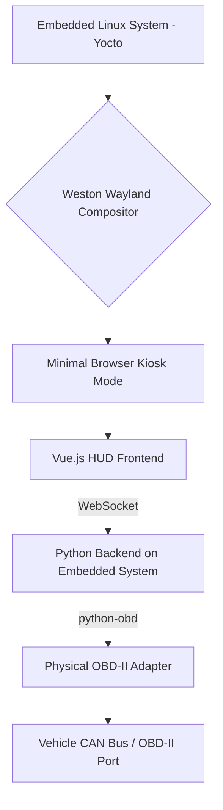
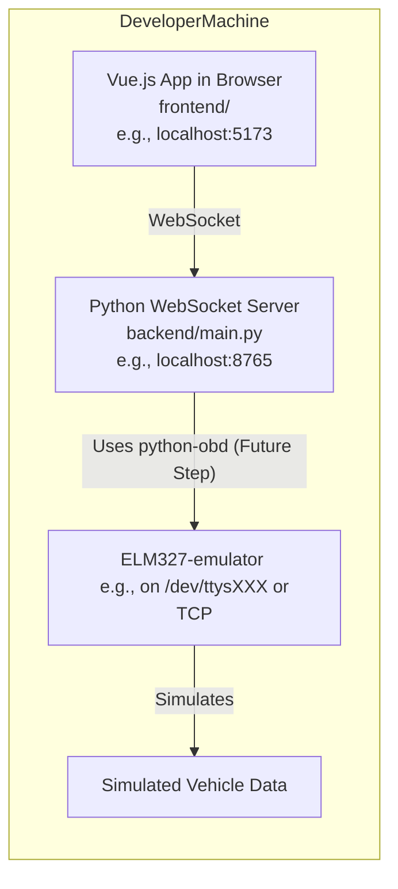

# Real-time Car HUD with Vue.js, Python, and OBD Simulation

## 1. Project Goal

The primary goal of this project is to develop a customizable car Heads-Up Display (HUD). This HUD will:
- Display real-time vehicle data (RPM, speed, coolant temperature, diagnostic codes, etc.).
- Feature engaging, user-selectable themes, with an initial focus on anime-inspired characters and animations that react to vehicle status.
- Ultimately run on a dedicated embedded Linux system (built with Yocto) using a transparent display.

**Core Technologies:**
- **Frontend:** Vue.js 3 with TypeScript, built using Vite.
- **Backend:** Python, providing data to the frontend via WebSockets.
- **Data Source:** On-Board Diagnostics (OBD-II) port of a vehicle.
    - **Initial Development & Testing:** Using `ELM327-emulator` to simulate OBD-II data.
    - **Later Stages:** Interfacing with a physical OBD-II adapter.

## 2. Current Status (As of May 11, 2025)

The project is in its initial setup and foundational development phase. Key achievements so far include:
- Establishment of a local development environment using `uv` for Python package management.
- Installation and basic operation of `ELM327-emulator`.
- Creation of a placeholder Python WebSocket server using the `websockets` library.
- Scaffolding of a Vue.js 3 + TypeScript frontend project using Vite in the `frontend/` subdirectory.
- Successful implementation of basic, bidirectional real-time communication between the Vue.js frontend and the Python WebSocket backend, allowing for multiple message exchanges.

## 3. Technical Overview & Architecture

The system is designed with a decoupled frontend and backend communicating over WebSockets.

### 3.1. Frontend
- **Framework:** Vue.js 3 with TypeScript.
- **Build Tool:** Vite for a fast development experience and optimized production builds.
- **Location:** `qwp/frontend/` directory.
- **Responsibilities:**
    - Establishing a WebSocket connection to the Python backend.
    - Receiving real-time vehicle data streams.
    - Rendering the HUD interface, including gauges, data readouts, and themed visuals (e.g., anime character reactions).
    - Handling user interactions for theme selection or display customization (future).

### 3.2. Backend
- **Language:** Python.
- **Location:** `qwp/backend/` directory.
- **Communication:** WebSocket server built with the `websockets` library.
- **OBD Interface:** Utilizes the `python-obd` library to interact with an ELM327-compatible OBD-II data source.
- **Responsibilities:**
    - Managing WebSocket connections with frontend clients.
    - Fetching data from the OBD source (initially the `ELM327-emulator`, later a real adapter).
    - Processing or translating OBD data as needed.
    - Streaming the relevant data in real-time to the connected Vue.js frontend.

### 3.3. OBD Data Simulation
- **Tool:** `ELM327-emulator`.
- **Purpose:** Allows for development and testing of the backend's OBD data handling and the frontend's data display logic without needing direct access to a physical vehicle or OBD-II adapter.
- **Features:**
    - Simulates an ELM327 adapter and vehicle ECU responses.
    - Supports configurable scenarios to mimic different vehicle states and data values.

### 3.4. Development Environment
- **Package Management:** `uv` is used for managing Python virtual environments and installing Python packages.
- **Frontend Build:** Vite handles the Vue.js development server and build process. `npm` (or `yarn`/`pnpm`, wrapped by `uv` where applicable) is used for Node.js dependencies.

### 3.5. Planned Embedded Target
- **Operating System:** A custom, minimal embedded Linux distribution built using the Yocto Project.
- **Display Management:** Weston (a Wayland compositor).
- **Application Host:** A minimal web browser running in kiosk mode to display the Vue.js application fullscreen.

### 3.6. Architecture Diagrams (Mermaid)

**Overall Target Architecture:**


**Current Development Setup:**


## 4. Project Setup & Progress (Chronological Steps Taken)

**Project Directory & Virtual Environment:**
- Created the main project folder (e.g., `qwp`).
- Initialized a Python virtual environment within it using `uv venv`. (Ensured activation with `source .venv/bin/activate`).

**Install ELM327 Emulator:**
- Installed ELM327-emulator and its dependencies into the virtual environment using `uv pip install ELM327-emulator`.

**Running the ELM327 Emulator:**
- Successfully ran the emulator using `elm -s car` (or `python3 -m elm -s car` after activating the venv).
- Observed it starting and listening on a pseudo-terminal (e.g., `/dev/ttys001` on macOS).

**Python Backend Placeholder:**
- Created a `backend/` subdirectory.
- Created an initial `backend/main.py` file.

**Install WebSocket Library for Backend:**
- Installed the `websockets` Python library using `uv pip install websockets`.

**Minimal Python WebSocket Server:**
- Implemented a basic asynchronous WebSocket server in `backend/main.py`.
- This server listens for client connections and echoes back any messages received.
- Iteratively debugged initial `TypeError` (handler arguments) and `AttributeError` (websocket.path vs websocket.remote_address) to achieve a stable server handler.

**Vue.js Project Setup (using Vite):**
- Scaffolded a new Vue.js 3 project inside `qwp/frontend/` using `npm create vue@latest`.
- Selected TypeScript as a feature.
- Installed Node.js dependencies (e.g., via `npm install`).
- Successfully ran the Vite development server using `npm run dev`.

**Vue.js WebSocket Client Implementation:**
- Modified the main Vue component (`frontend/src/App.vue`) to include WebSocket client logic.
- The Vue app now:
  - Establishes a WebSocket connection to the Python backend on component mount.
  - Handles `onopen`, `onmessage`, `onclose`, and `onerror` events.
  - Allows sending messages to the server via an input field.
  - Displays connection status and received messages.
- Successfully tested sending multiple messages back and forth between the Vue client and Python server.

## 5. How to Run the Current Setup

To run the project in its current state, you'll typically need three terminal sessions.

**Terminal 1: Start ELM327 Emulator**
(While the Python backend doesn't connect to it yet, it's part of the intended setup.)

```bash
# Navigate to your project directory (e.g., qwp)
cd path/to/your/qwp
# Activate Python virtual environment
source .venv/bin/activate
# Start the emulator
elm -s car
```
(Note the pseudo-terminal it's running on, e.g., `/dev/ttys001`. You'll need this later.)

**Terminal 2: Start Python WebSocket Backend**

```bash
# Navigate to your project directory (e.g., qwp)
cd path/to/your/qwp
# Activate Python virtual environment (if not already from same terminal)
source .venv/bin/activate
# Run the backend server
python backend/main.py
```
(This will typically start on `ws://localhost:8765`.)

**Terminal 3: Start Vue.js Frontend Development Server**

```bash
# Navigate to your Vue project directory
cd path/to/your/qwp/frontend
# Run the Vite development server
npm run dev
```
(This will typically start the frontend on `http://localhost:5173` or a similar port. Check the terminal output for the exact URL.)

**Finally:**
Open the URL provided by the Vite dev server in your web browser to interact with the Vue.js HUD client.

## 6. Next Steps (Planned)

**Integrate python-obd with Backend:**
- Install python-obd into the virtual environment (`uv pip install obd`).
- Modify `backend/main.py` to:
  - Establish a connection to the ELM327-emulator using python-obd (connecting to the pseudo-terminal or TCP port the emulator provides).
  - Periodically query for basic OBD PIDs (e.g., RPM, Vehicle Speed) from the emulator.

**Stream Real OBD Data (Simulated):**
- Change the Python WebSocket server to send the fetched (simulated) OBD data to connected Vue.js clients instead of just echoing messages. Data should likely be sent as JSON.

**Display OBD Data in Vue.js Frontend:**
- Update `frontend/src/App.vue` (or new components) to:
  - Parse the JSON data received over WebSockets.
  - Store and reactively display values like RPM, speed, etc.
  - Start designing the basic HUD layout.

**Develop HUD UI/Themes:**
- Create Vue components for different HUD elements (gauges, readouts).
- Implement the anime-inspired themes and character animations based on the received data.

**Advanced Emulator Scenarios:**
- Configure ELM327-emulator with more specific scenarios and data values relevant to the HUD's features.

**Transition to Physical OBD-II Adapter:**
- Test the Python backend with a real OBD-II adapter connected to a vehicle.

**Embedded Linux (Yocto) Preparation:**
- Begin development of the Yocto build for the target embedded hardware.
- Configure Weston and a kiosk browser.

## 7. Directory Structure

```
qwp/
├── .venv/                  # Python virtual environment created by uv
├── backend/
│   └── main.py             # Python WebSocket server
├── frontend/               # Vue.js frontend application
│   ├── node_modules/       # Node.js dependencies for Vue project
│   ├── public/             # Vue.js public assets
│   ├── src/                # Vue.js source files
│   │   ├── assets/
│   │   ├── components/
│   │   ├── App.vue         # Main Vue component with WebSocket client logic
│   │   └── main.ts         # Vue application entry point
│   ├── .gitignore          # Specific to frontend, or use root .gitignore
│   ├── index.html          # Main HTML file for the Vue app
│   ├── package-lock.json
│   ├── package.json        # Vue project dependencies and scripts
│   ├── tsconfig.json       # TypeScript configuration for Vue project
│   ├── tsconfig.node.json
│   └── vite.config.ts      # Vite configuration
└── README.md               # This file (in the qwp/ root)
```

This README should provide a good snapshot of your project. Remember to update it as you make further progress!

**Important Notes for You:**

* **Mermaid Diagrams:** To make the Mermaid diagrams render correctly on platforms like GitHub, you just need to ensure the code blocks are fenced with ````mermaid ... ````. GitHub and many other Markdown viewers will then render them as diagrams.
* **Directory Structure:** The structure above reflects that your Vue project was scaffolded into a `frontend` subdirectory of the `qwp` root.
* **Keep it Updated:** A good README is a living document. Update it as you complete next steps, add new features, or change the architecture.